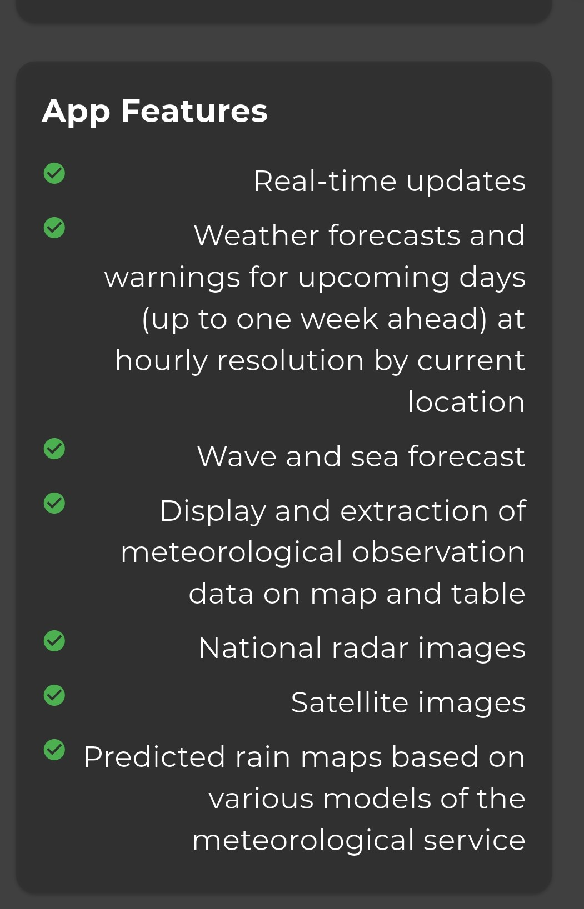

**Bug Report for the IMS (Israel Meteorological Service) Android app**

**Date**: 25/10/2025  

## Title
Incorrect text alignment and direction in the "About" page when app language is English.

## Description
When the app language is set to English, the text in some of the sections in the "About" page is aligned to the left instead of to the right, and the text direction is RTL instead of LTR.

## Steps to Reproduce
1. Open the IMS app
2. Tap the hamburger menu button
3. Tap the "הגדרות" menu item
4. The settings page will appear
5. Tap the "שפה" button
6. Choose "English"
7. Tap the back button on the top left ("<")
8. Tap the "About" button
9. Observe the About page

## Expected Result
All the sections are both aligned to the left and the text direction is LTR.

## Actual Results
Multiple sections are RTL and aligned right (e.g. the "General Information" section)

## Environment
IMS app version: 1.4.8     
OS: Xiaomi HyperOS 2.0.11.0 (based on Android 14)    
Device: Poco x5 pro 5g    
Device Language: English    

## Severity
Minor, small visual bug

## Screenshots

   
