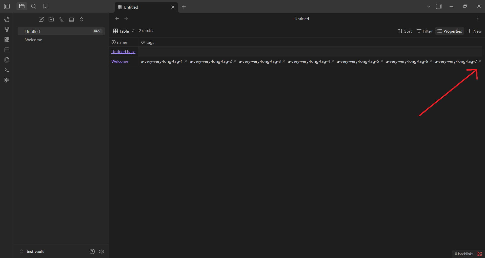

**Bug Report for Obsidian Desktop**

**Date**: 14/10/2025  

## Title
Bases - tags crop at the end and horizontal scrolling disabled

## Description
In bases, the entry for a note with a large amount of tags is cropped on the right, with some of the tags not showing, and with horizontal scrolling disabled.  

## Steps to Reproduce
1. Create a new Obsidian vault, name it 'test vault' and choose 'Desktop' for the location
2. A new vault will open
3. Maximize the window 
4. Close the 'Graph view' tab
5. Open the preloaded 'Welcome' note, if not already opened
6. Click on the '>_' button on the left side panel to open the command palette
7. In command palette write 'add file property' then click 'enter'
8. Select the 'tags' option in the menu that appeared
9. In the textbox near the word 'tags' enter the following values one by one (press 'Enter' after every value to add it as a tag):  
    - VALUES = "a-very-very-long-tag-i", without quotes, for every i from 1 to 10
10. Right click the empty space just below 'Welcome' file in the left 'Files' panel
11. Click 'New base' to add a new base
12. On the base page that just appeared, click on the 'Properties' button on the right side of the screen, and select 'tags'
13. A 'tags' column will now appear in the base
14. Observe the 'tags' column
15. Try and scroll horizontally in both directions

## Expected Result
For the 'Welcome' page entry, all tags are visible either immediately or after scrolling horizontally.

## Actual Result
Some tags at the end of the tag list are missing from the column, and scrolling horizontally is disabled

## Environment
Operating System: Windows 11, 25H2, 26200.6725  
Computer: Dell Inspiron 3593 laptop  
Screen Size: 15.6 Inches  
Screen Resolution: 1920 x 1080  
App Version: Obsidian v1.9.14  
  

## Severity
Medium, user experience impacted, not all selected information is visible

## Screenshot
