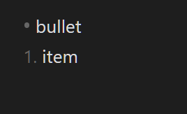
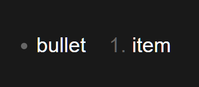

**Bug Report for Obsidian Desktop**

**Date**: 26/10/2025  

## Title
Slides core plugin - sequential numbered and bullet point lists render incorrectly in presentation mode.

## Description
In the 'Slides' core plugin 'presentation mode', when numbered lists come right after bullet point lists, some items render on the same line instead of on separate lines. 

## Steps to Reproduce
1. Create a new Obsidian vault, name it 'test vault' and choose the 'Documents' folder
2. A new vault will open
3. Maximize the window 
4. Close the 'Graph view' tab
5. Create a new note by clicking the new note icon on the left side panel (will be named 'Untitled' by default)
7. Go To Settings (Gear Icon) => Core Plugins => Enable 'Slides' if not already enabled
8. Return to the 'Untitled' note
9. Paste all the contents from 'test_files/test_list.txt' into the 'Untitled' note
10. Observe the resulting list
11. Open the command pallet by clicking the '>_' icon on the left ribbon
12. Type 'Slides: Start presentation' without quotes, then press 'Enter'
13. Observe the list in the presentation, and compare visually against the list in the note

## Expected Result
In the presentation the numbered list item is below the bullet list item, like in the 'Untitled' note.

## Actual Result
The the numbered list item is to the right of the bullet list item, on the same line.

## Environment
Operating System: Windows 11, 25H2, 26200  
Computer: Dell Inspiron 3593 laptop     
App Version: Obsidian v1.9.14  
  

## Severity
Moderate. Bullet points and numbered lists are used often, and combining them one after the other may not be uncommon (although we don't have exact data).
The presentation rendering makes the lists' meaning somewhat unclear.

## Screenshots

