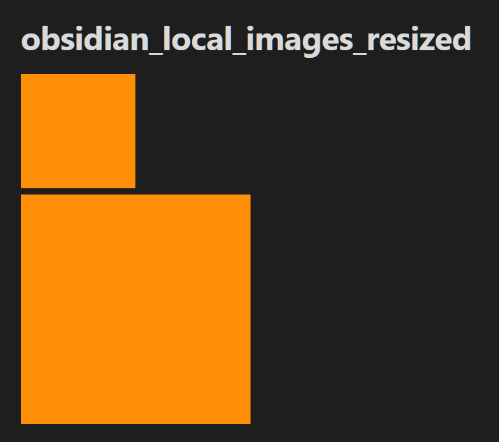
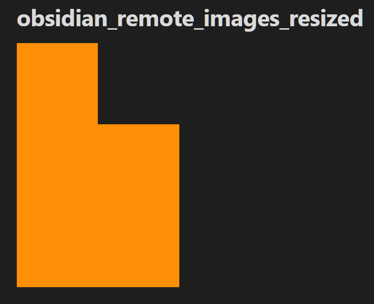

**Bug Report for Obsidian Desktop**

**Date**: 28/10/2025  

## Title
Slides core plugin - resizing remote images isn't applied in presentation mode 

## Description
In the 'Slides' core plugin, resized remote images do not render in their new size in 'presentation mode', while local resized images do.

## Steps to Reproduce
1. Create a new Obsidian vault, name it `test vault` and choose the `Documents` folder
2. A new vault will open
3. Maximize the window 
4. Close the `Graph view` tab
5. Drag and drop the following 3 files into the left `Files` pane: 
    1. `test_files/Dark_orange.png`
    2. `test_files/obsidian_local_images_resized.md`
    3. `test_files/obsidian_remote_images_resized.md`
6. Go To Settings (Gear Icon) => Core Plugins => Enable 'Slides' if not already enabled
7. First, open the `obsidian_local_images_resized` note
8. Notice the difference in size between the two dark orange squares.
9. Activate presentation mode by clicking the command palette `>_`  button on left ribbon and type `Slides: Start presentation` without quotes, then press `Enter`
10. Now, Observe the size differences between the squares
11. Next, open the `obsidian_remote_images_resized` note and repeat steps 8, 9, 10 for it.

## Expected Result
For both notes, in presentation mode, the two squares have different sizes, similarly to how they render in the note.

## Actual Result
For local images, both in the note and in presentation mode, the two squares render with different sizes.  
For remote images, in the note the two squares are of different size, but in presentation mode they are of the same size, indicating that resizing wasn't applied there.

## Environment
Operating System: Windows 11, 25H2, 26200  
Computer: Dell Inspiron 3593 laptop     
App Version: Obsidian v1.9.14  
  

## Severity
Low, images are still visible, and if necessary could be resized manually in an image editor.

## Screenshots
### Note view, local images:

### Presentation mode, local images: 

### Note view, remote images: 

### Presentation mode, remote images: 

