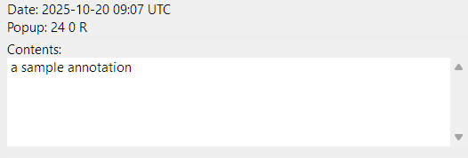

**Bug Report for SumatraPDF Desktop**

**Date**: 20/10/2025  

## Title
Timezone for annotation timestamps is UTC instead of the OS-defined timezone  

## Description
When adding a text annotation to a pdf document, the time and timezone displayed on the annotation side panel is UTC, instead of the local machine time and timezone.

## Steps to Reproduce
1. Open SumatraPDF 
2. Open any pdf document (hamburger menu button -> fie -> open)
3. Right click anywhere on the document -> 'Create Annotation Under Cursor' -> 'Text'
4. Observe the time and timezone in the 'Date' field

## Expected Result
The time is the current local time, and the timezone is the OS locale timezone (for example GMT+number).

## Actual Result
The time is the current local time in UTC, and the timezone is 'UTC'.

## Environment
Operating System: Windows 11, 25H2, 26200.6899  
SumatraPDF Version: v3.5.2 64 bit
  

## Severity
Low, the annotation time is technically correct, despite being in a different timezone.

## Screenshot
