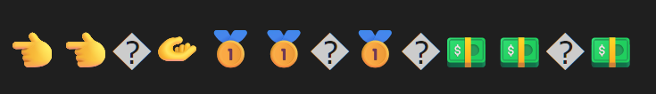

**Bug Report for SumatraPDF Desktop**

**Date**: 22/10/2025  

## Title
Incorrect emojis copied from PDF

## Description
When copying emojis from a PDF opened in SumatraPDF into a text editor, the pasted emojis sometimes don't match the copied ones.

## Steps to Reproduce
1. Open SumatraPDF 
2. Open the emoji test document (`test_files/emoji_pdf.pdf`), which contains the following string of emojis:  
 👈👉🫴🥇🥈🥉💵💶💷
3. Select the whole string with the cursor (not with ctrl+a)
4. Copy with `ctrl+C`
5. Paste in a text editor
6. Observe the difference between the copied emojis and the pasted emojis

## Expected Result
The pasted emoji string is identical to the copied emoji string.

## Actual Result
The pasted emoji string is different from the copied emoji string. It contains some incorrect emojis and question mark characters, which aren't in the original string.

## Environment
Operating System: Windows 11, 25H2, 26200.6901   
SumatraPDF Version: v3.5.2 64 bit   
Text Editors:
- Google Docs in Chrome Version 141.0.7390.77
- Visual Studio Code Version 1.105.1
  

## Severity
Medium-Low, some PDFs contain emojis, and copying text snippets from a PDF may be common among users, although we don't have exact statistics.

## Screenshots

SumatraPDF:

Google Docs:

Visual Studio Code:

 