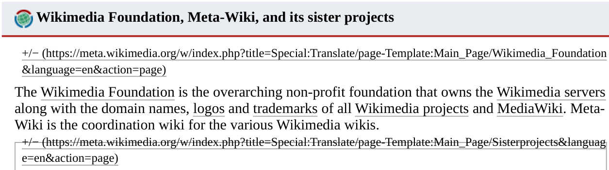

**Bug Report for wikimedia.org**

**Date**: 13/10/2025  

## Title
Save to pdf - top border of element covers text 

## Description
In the pdf version of the Main Page of English Wikimedia, the top border of one element partially covers a line of text.

## Steps to Reproduce
1. Navigate to `https://meta.wikimedia.org/wiki/Main_Page`  
2. click on 'Tools' then on 'Download as PDF'
3. you will be redirected to `https://meta.wikimedia.org/w/index.php?title=Special:DownloadAsPdf&page=Main_Page&action=show-download-screen`
4. Click the blue 'Download' button
5. Open the pdf with a pdf viewer
6. Find the sentence "Meta-Wiki is the coordination wiki for..."
7. Observe the link right below it, `+/− (https://meta.wikimedia.org/w/index.php?title=Special:Translate/page-Template:Main_Page/Sisterprojects&languag
e=en&action=page)
`

## Expected Result
Any visible element does not fully or partially hide text, unless it's text decoration (e.g. strikethrough).

## Actual Result
The top border of a section partially hides the link text in step 7

## Environment
Browser: Google Chrome Version 141.0.7390.77 (Official Build) (64-bit)  
Operating System: Windows 11 - 25H2 Home Edition  
PDF viewers: 1. built in chrome viewer and 2. SumatraPDF   

## Severity
Minor (cosmetic bug, doesn't impair main page contents readability)

## Screenshot
